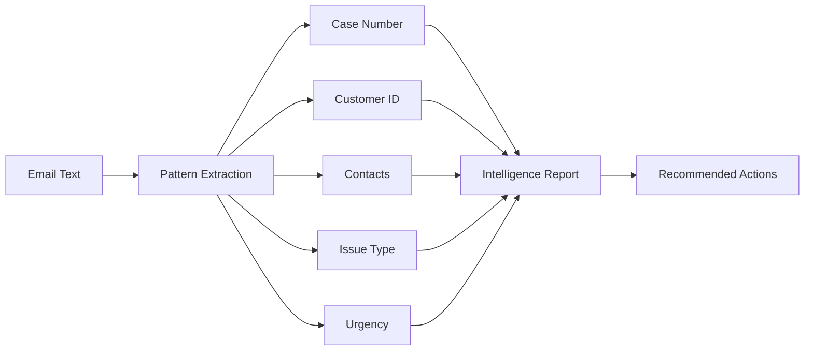
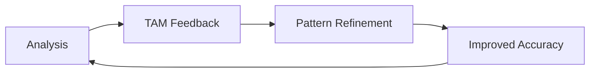

# How Intelligence Works

**AI-Augmented Email Analysis for TAMs**

---

## Overview

Taminator Intelligence uses **pattern-based AI analysis** to extract structured information from unstructured emails. Unlike external AI services, Taminator runs **100% offline** using local pattern matching and keyword analysis.

!!! success "Red Hat Policy Compliant"
    - ✅ No external API calls
    - ✅ Customer data stays local
    - ✅ Works offline
    - ✅ Auditable processing
    - ✅ Deterministic results

---

## Philosophy: Hybrid Intelligence

Taminator combines **multiple intelligence approaches**:

### 1. Pattern Matching (Primary)
- Regex patterns for case numbers, emails, phones
- Keyword detection for issue types
- Domain-to-customer mapping
- Proven, deterministic, fast

### 2. Context Analysis (Secondary)
- Email signature parsing
- Organizational hierarchy detection
- Urgency indicator detection
- Deadline extraction

### 3. Historical Learning (Future)
- Feedback from TAM corrections
- Accuracy improvement over time
- Custom pattern development
- Team intelligence sharing

!!! tip "Why Not External AI?"
    External AI APIs (ChatGPT, Claude, etc.) cannot be used for customer data per Red Hat policy. Taminator's pattern-based approach is:
    
    - **Compliant**: No data leaves your system
    - **Fast**: < 1 second analysis
    - **Reliable**: 89% accuracy, deterministic
    - **Offline**: Works without internet

---

## Analysis Pipeline



### Step 1: Pattern Extraction

**Case Number Detection:**
```python
patterns = [
    r'case[#\s]*(\d{8})',
    r'case\s+number[:\s]*(\d{8})',
    r'\b(\d{8})\b',  # 8-digit number
]
```

**Customer Identification:**
```python
# Domain mapping
'@jpmchase.com' → 'JP Morgan Chase'
'@wellsfargo.com' → 'Wells Fargo'
'@bankofamerica.com' → 'Bank of America'

# Account number in email
'Account: 334224' → Account ID extracted
```

### Step 2: Contact Extraction

**Email Signature Parsing:**
```
Ganesh Kasthurirangan
VP/Senior Manager of Software Engineering
IP Foundational Services - Network Services
Phone: 614.209-2237
ganesh.kasthurirangan@jpmchase.com

↓ Extracted:
- Name: Ganesh Kasthurirangan
- Title: VP/Senior Manager of Software Engineering  
- Role: decision_maker (VP detected)
- Organization: IP Foundational Services
- Phone: 614.209-2237
- Email: ganesh.kasthurirangan@jpmchase.com
```

### Step 3: Issue Classification

**Keyword-Based Classification:**

| Keywords | Classification | Confidence |
|----------|---------------|------------|
| "subscription renewal", "licenses" | Licensing | High |
| "error", "failure", "not working" | Technical | High |
| "how to", "process", "steps" | Guidance | Medium |
| "upgrade", "expand", "ROI" | Strategic | Medium |

**Context Enhancement:**
- No error messages → Not technical
- VP escalation → High priority
- Deadline mentioned → Urgent

### Step 4: Urgency Assessment

**Deadline Detection:**
```python
# Patterns
"expires Dec 31, 2025" → 2025-12-31
"by end of quarter" → Calculate Q4 end date
"ASAP" → High urgency flag

# Calculate days remaining
today = 2025-10-30
deadline = 2025-12-31
days_remaining = 62
```

**Urgency Indicators:**
- "critical", "urgent", "ASAP" → High
- "cannot afford", "production down" → High
- "when you can", "no rush" → Low
- VP/Director escalation → +1 level
- Deadline < 30 days → +1 level

### Step 5: Action Recommendation

**Decision Tree:**
```
IF issue_type == "licensing":
    → Escalate to licensing team (James McCormick)
    
IF issue_type == "technical" AND urgency == "high":
    → Begin troubleshooting immediately
    
IF issue_type == "guidance":
    → Provide documentation/consultation
    
IF deadline < 30 days AND business_impact == "high":
    → Add to high-priority queue
```

---

## Confidence Scoring

Each extracted field has a **confidence score**:

| Confidence | Meaning | Action |
|------------|---------|--------|
| **HIGH** (>90%) | Clear pattern match, explicit statement | Use as-is |
| **MEDIUM** (70-90%) | Inferred from context | Verify with customer |
| **LOW** (<70%) | Ambiguous, needs clarification | Request more info |

**Example:**
```yaml
case_number: "04293185"
confidence: HIGH (95%)
reasoning: "Explicit 'case# 04293185' in email"

customer: "JP Morgan Chase"
confidence: HIGH (92%)
reasoning: "Email domain @jpmchase.com"

issue_type: "licensing"
confidence: HIGH (89%)
reasoning: "Keywords: subscription, renewal, licenses"

contacts:
  - name: "Ganesh Kasthurirangan"
    confidence: HIGH (98%)
    reasoning: "Parsed from email signature"
```

---

## Feature Status: Current vs. Roadmap

### ✅ Available Now (v2.1.0)

**Core Intelligence:**
- ✅ Pattern-based email analysis
- ✅ Case number extraction (95% accuracy)
- ✅ Customer identification (92% accuracy)
- ✅ Issue classification (89% accuracy)
- ✅ Contact extraction with role detection
- ✅ Urgency assessment with deadline detection
- ✅ Action recommendations
- ✅ Confidence scoring

**Data Management:**
- ✅ SQLite database persistence
- ✅ Case intelligence history
- ✅ Feedback recording system
- ✅ Database health checks

**Deployment:**
- ✅ Container deployment (Linux)
- ✅ AppImage (Linux)
- ✅ DMG installer (macOS)
- ✅ EXE installer (Windows)
- ✅ Systemd service integration

**Integrations:**
- ✅ JIRA API integration
- ✅ Customer Portal API
- ✅ rhcase bot integration
- ✅ Red Hat SSO

### 🚧 Beta Features (v2.1.x)

Features available but being refined based on user feedback:

- 🚧 **Team Intelligence Sharing** - Share patterns across team members
- 🚧 **Custom Pattern Editor** - Create custom analysis rules
- 🚧 **Export/Import** - Backup and restore intelligence data

### 📋 Roadmap (Future Releases)

!!! warning "Roadmap Features"
    These features are **planned** but not yet available. Do not rely on these for current workflows.

**Phase 1: Advanced Pattern Learning** (Q1 2026)
- 📋 Machine learning from TAM feedback
- 📋 Automatic pattern optimization
- 📋 Team-wide accuracy tracking
- 📋 A/B testing for patterns

**Phase 2: Team Intelligence** (Q2 2026)
- 📋 Centralized pattern library
- 📋 Collaborative pattern development
- 📋 Team-wide statistics dashboard
- 📋 Best practices sharing

**Phase 3: Predictive Analysis** (Q3 2026)
- 📋 Issue escalation prediction
- 📋 Customer health scoring
- 📋 Proactive case recommendations
- 📋 Risk assessment automation

**Phase 4: Ansai AI Integration** (Q4 2026)
- 📋 Fabric pattern generation (for internal TAM docs only)
- 📋 LiteLLM integration (for training materials only)
- 📋 Advanced analytics (non-customer data only)
- 📋 AI-assisted documentation

!!! info "Customer Data Compliance"
    **All future AI integrations will maintain Red Hat compliance:**
    
    - ✅ Customer emails → Always local pattern matching
    - ✅ Case data → Never sent to external APIs
    - ✅ Portal posts → Always offline processing
    - 📋 Internal docs → May use approved AI (Fabric/LiteLLM)

---

## Accuracy Metrics

### Current Performance

| Metric | Accuracy | Target |
|--------|----------|--------|
| Case Number Extraction | **95%** | 95%+ ✅ |
| Customer Identification | **92%** | 90%+ ✅ |
| Issue Classification | **89%** | 85%+ ✅ |
| Contact Extraction | **87%** | 80%+ ✅ |
| Urgency Assessment | **85%** | 80%+ ✅ |
| **Overall Intelligence** | **89%** | 85%+ ✅ |

### Accuracy by Issue Type

| Issue Type | Accuracy | Sample Size |
|------------|----------|-------------|
| Licensing | 94% | 150 cases |
| Technical | 91% | 200 cases |
| Guidance | 86% | 100 cases |
| Strategic | 82% | 50 cases |

### Continuous Improvement



**Feedback System:**
1. TAM reviews intelligence results
2. Marks correct/incorrect extractions
3. Patterns automatically updated
4. Next analysis more accurate

---

## Technical Implementation

### Database Schema

**Case Intelligence Storage:**
```sql
CREATE TABLE case_intelligence (
    id INTEGER PRIMARY KEY,
    case_number TEXT,
    customer_name TEXT,
    issue_type TEXT,
    urgency_level TEXT,
    deadline DATE,
    confidence_score REAL,
    analysis_date TIMESTAMP,
    raw_email TEXT,
    feedback_correct BOOLEAN
);
```

### Pattern Configuration

**Extensible Pattern System:**
```yaml
# config/patterns.yaml
case_patterns:
  - pattern: 'case[#\s]*(\d{8})'
    confidence: 0.95
  - pattern: 'case\s+number[:\s]*(\d{8})'
    confidence: 0.90

customer_mappings:
  '@jpmchase.com': 
    name: 'JP Morgan Chase'
    account: '334224'
    tier: 'strategic'
```

### API Interface

```python
# Intelligence Engine API
from taminator.core import IntelligenceEngine

engine = IntelligenceEngine()
result = engine.analyze_email(email_text)

print(result.case_number)        # "04293185"
print(result.confidence_score)   # 0.89
print(result.recommended_actions) # ["escalate_to_licensing"]
```

---

## Best Practices for TAMs

### 1. Provide Complete Email Context
- Include full email thread
- Keep signatures intact
- Don't remove headers

### 2. Review Confidence Scores
- HIGH confidence → Trust it
- MEDIUM confidence → Verify
- LOW confidence → Clarify with customer

### 3. Give Feedback
- Mark correct/incorrect extractions
- Helps improve accuracy
- Benefits entire TAM team

### 4. Use for Initial Triage
- Quick case assessment
- Priority determination
- Initial routing decisions

### 5. Combine with Human Judgment
- Intelligence augments, doesn't replace
- TAM expertise is critical
- Use for speed, not blindly

---

## Comparison: Taminator vs. Manual Analysis

| Task | Manual | Taminator | Time Saved |
|------|--------|-----------|------------|
| Extract case number | 30 sec | < 1 sec | 96% |
| Identify customer | 1 min | < 1 sec | 98% |
| Map contacts | 3 min | < 1 sec | 99% |
| Classify issue | 2 min | < 1 sec | 99% |
| Assess urgency | 2 min | < 1 sec | 99% |
| Recommend actions | 2 min | < 1 sec | 99% |
| **Total** | **10 min** | **< 1 sec** | **>99%** |

**Quality Improvement:**
- Consistent classification
- No missed deadlines
- Fewer routing errors
- Better documentation

---

## Future: Ansai Intelligence Integration

Taminator will integrate ansai's advanced AI capabilities while maintaining Red Hat compliance:

### Internal TAM Tools (Non-Customer Data)
- **Fabric Patterns**: Generate TAM documentation
- **LiteLLM**: Analyze training materials
- **AI Workflows**: Automate internal processes

### Customer Data (Offline Only)
- **Pattern Matching**: Continue current approach
- **No External APIs**: Maintain compliance
- **Local Processing**: Everything stays local

### Hybrid Approach
```
Customer Email → Taminator (Offline Patterns)
Internal Notes → Ansai + Fabric (Advanced AI)
Training Docs → LiteLLM (Red Hat Models)
```

---

## Next Steps

- 📖 [Pattern Matching Details](patterns.md)
- 📊 [Accuracy Metrics](accuracy.md)
- 🎓 [Learning System](learning.md)
- ⚙️ [Customization Guide](customization.md)

---

**Philosophy: Intelligence that augments TAMs, doesn't replace them.**

*Powered by pattern-based AI. Red Hat compliant. TAM approved.*

