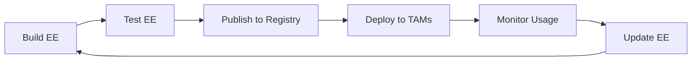

# Taminator Intelligence - Execution Environment Philosophy

**Applying AAP Execution Environment principles to TAM tooling**

---

## 🎯 What is an Execution Environment?

### **AAP Definition:**
> "Execution Environments are container images that serve as Ansible control nodes. They provide a consistent, reproducible, and portable automation environment."

### **Taminator Adaptation:**
> "Taminator Intelligence Execution Environment is a container image that provides a consistent, reproducible, and portable AI-augmented case analysis environment."

---

## 🏗️ Core Principles (From AAP)

### **1. Consistency**
- ✅ Same runtime environment everywhere
- ✅ No "works on my machine" problems
- ✅ Predictable behavior across TAM workstations

### **2. Portability**
- ✅ Run on laptop, server, or cloud
- ✅ Move between environments seamlessly
- ✅ Share with team without dependency hell

### **3. Isolation**
- ✅ No conflicts with system Python
- ✅ No dependency version conflicts
- ✅ Clean separation from host system

### **4. Reproducibility**
- ✅ Build once, run anywhere
- ✅ Version-controlled environment
- ✅ Auditable and traceable

### **5. Self-Contained**
- ✅ All dependencies included
- ✅ No external downloads at runtime
- ✅ Works offline

---

## 📦 Taminator EE Architecture

### **Layered Approach (Like AAP):**

```
┌─────────────────────────────────────┐
│   Taminator Intelligence Layer      │  ← Your intelligence engine
│   - Intelligence engine             │
│   - SQLite database                 │
│   - IPC bridge                      │
│   - CLI tools                       │
└─────────────────────────────────────┘
┌─────────────────────────────────────┐
│   Python Runtime Layer              │  ← Python + stdlib
│   - Python 3.11                     │
│   - Standard library                │
│   - SQLite (built-in)               │
└─────────────────────────────────────┘
┌─────────────────────────────────────┐
│   Base OS Layer                     │  ← Red Hat UBI9
│   - Red Hat Universal Base Image 9  │
│   - Minimal system dependencies     │
│   - Security updates                │
└─────────────────────────────────────┘
```

### **Why This Matters:**
- **Base Layer:** Red Hat supported, security patched
- **Runtime Layer:** Consistent Python version
- **Intelligence Layer:** Your code, versioned and tested

---

## 🔧 Building Execution Environments

### **AAP Way (ansible-builder):**
```bash
# Define environment
cat > execution-environment.yml <<EOF
version: 3
images:
  base_image:
    name: registry.redhat.io/ansible-automation-platform-24/ee-minimal-rhel9:latest
dependencies:
  python:
    - ansible-core>=2.15
EOF

# Build
ansible-builder build -t my-ee:1.0.0
```

### **Taminator Way (podman/docker):**
```bash
# Define environment (Containerfile)
# Build
podman build -t taminator-intelligence:2.1.0 -f Containerfile .

# Or use ansible-builder style
ansible-builder build -f execution-environment.yml -t taminator-ee:2.1.0
```

---

## 🚀 Deployment Models (AAP-Inspired)

### **Model 1: Local Execution (Like AAP CLI)**
```bash
# TAM runs on laptop
podman run -it --rm \
  -v ~/.taminator:/app/data:Z \
  taminator-intelligence:2.1.0 \
  python3 -m taminator.commands.analyze -f email.txt
```

**Use Case:** Individual TAM, offline work, CLI preference

### **Model 2: Service Mode (Like AAP Controller)**
```bash
# TAM runs as service
systemctl --user start taminator-intelligence

# Access via API
curl http://localhost:8080/api/analyze -d '{"email": "..."}'
```

**Use Case:** Always-on service, web interface, automation

### **Model 3: Shared Service (Like AAP Hub)**
```bash
# Team server
sudo systemctl start taminator-intelligence

# Team access
https://taminator.team.redhat.com
```

**Use Case:** Team sharing, centralized learning, collaboration

---

## 📊 Execution Environment Benefits

### **For TAMs:**
| Benefit | Description |
|---------|-------------|
| **No Setup** | Pull image, run container - done |
| **No Conflicts** | Isolated from system Python |
| **Consistent** | Same environment as teammates |
| **Offline** | All dependencies included |
| **Updatable** | Pull new image, restart |

### **For TAM Leadership:**
| Benefit | Description |
|---------|-------------|
| **Standardized** | Everyone uses same environment |
| **Auditable** | Know exactly what's running |
| **Supportable** | Fewer "it doesn't work" issues |
| **Scalable** | Easy to deploy to new TAMs |
| **Compliant** | Red Hat base, approved tooling |

### **For Red Hat:**
| Benefit | Description |
|---------|-------------|
| **Policy Compliant** | Uses Red Hat UBI base |
| **Security** | Regular security updates |
| **Supportable** | Standard container platform |
| **Auditable** | Traceable builds |
| **Offline Capable** | No external dependencies |

---

## 🔄 Lifecycle Management (AAP Model)

### **Build → Test → Publish → Deploy → Update**



### **Build:**
```bash
# Developer builds new version
podman build -t taminator-intelligence:2.2.0 -f Containerfile .
```

### **Test:**
```bash
# Automated tests
podman run --rm taminator-intelligence:2.2.0 python3 -m pytest

# Integration tests
./tests/test-ee.sh
```

### **Publish:**
```bash
# Tag and push to registry
podman tag taminator-intelligence:2.2.0 registry.gitlab.com/jbyrd/taminator:2.2.0
podman push registry.gitlab.com/jbyrd/taminator:2.2.0
```

### **Deploy:**
```bash
# TAMs pull new version
podman pull registry.gitlab.com/jbyrd/taminator:2.2.0
systemctl --user restart taminator-intelligence
```

### **Update:**
```bash
# Automatic updates (optional)
# Add to systemd service:
ExecStartPre=/usr/bin/podman pull registry.gitlab.com/jbyrd/taminator:latest
```

---

## 🎓 TAM Familiarity Advantage

### **TAMs Already Know:**
- ✅ Execution Environments (from AAP work)
- ✅ Container concepts (customer deployments)
- ✅ Podman/Docker (daily tools)
- ✅ Systemd services (RHEL administration)
- ✅ Image registries (customer support)

### **Learning Curve:**
- **AAP User:** 5 minutes (same concepts)
- **Container User:** 10 minutes (familiar tooling)
- **New to Containers:** 30 minutes (guided setup)

### **Mental Model:**
```
AAP Execution Environment = Ansible automation runtime
Taminator EE = Intelligence automation runtime

Same philosophy, different automation domain
```

---

## 🔐 Security & Compliance (AAP Standards)

### **Image Security:**
- ✅ Red Hat UBI9 base (supported, patched)
- ✅ Minimal attack surface (no unnecessary packages)
- ✅ Non-root user (1001)
- ✅ Read-only filesystem (where possible)
- ✅ No secrets in image (runtime injection)

### **Runtime Security:**
- ✅ SELinux enforcing (`:Z` volume mounts)
- ✅ Resource limits (CPU, memory)
- ✅ Network isolation (localhost only by default)
- ✅ Health checks (automatic restart)
- ✅ Audit logging (systemd journal)

### **Compliance:**
- ✅ Red Hat AI Policy compliant
- ✅ No external API calls
- ✅ Customer data stays local
- ✅ Auditable builds
- ✅ Version-controlled

---

## 📈 Scaling with Execution Environments

### **Individual TAM (1 user):**
```bash
# Local EE on laptop
podman run --user 1001 -v ~/.taminator:/app/data:Z taminator-intelligence:2.1.0
```

### **Team (5-20 TAMs):**
```bash
# Shared EE on server
sudo systemctl start taminator-intelligence
# Access via web interface
```

### **Organization (100+ TAMs):**
```bash
# Kubernetes deployment
kubectl apply -f taminator-deployment.yaml
# Load balanced, highly available
```

### **Enterprise (1000+ users):**
```bash
# OpenShift deployment
oc new-app taminator-intelligence:2.1.0
# Multi-region, auto-scaling
```

---

## 🛠️ Advanced EE Features (Future)

### **Custom EEs (Like AAP):**
```yaml
# Custom EE with additional tools
version: 3
images:
  base_image:
    name: taminator-intelligence:2.1.0
dependencies:
  python:
    - pandas  # For advanced analytics
    - matplotlib  # For visualizations
additional_build_steps:
  append_final:
    - RUN pip install custom-tam-tools
```

### **Private EE Registry (Like Automation Hub):**
```bash
# Internal registry
podman login registry.corp.redhat.com
podman push registry.corp.redhat.com/tam-tools/taminator:2.1.0

# TAMs pull from internal registry
podman pull registry.corp.redhat.com/tam-tools/taminator:2.1.0
```

### **EE Versioning Strategy:**
```
taminator-intelligence:2.1.0        # Specific version
taminator-intelligence:2.1          # Minor version (auto-updates)
taminator-intelligence:2            # Major version (auto-updates)
taminator-intelligence:latest       # Latest stable
taminator-intelligence:dev          # Development builds
```

---

## 🎯 Success Metrics

### **Adoption:**
- Week 1: 5 TAMs using EE
- Week 4: 50 TAMs using EE
- Month 3: 100+ TAMs using EE

### **Quality:**
- Build success rate: >95%
- Image size: <500MB
- Startup time: <5 seconds
- Health check pass rate: >99%

### **Support:**
- "It doesn't work" tickets: <5 per month
- Average resolution time: <30 minutes
- TAM satisfaction: >4.5/5

---

## 📚 Documentation Alignment

### **AAP Documentation Style:**
- Getting Started Guide
- Installation Guide
- User Guide
- Administration Guide
- Release Notes

### **Taminator Documentation:**
- [Getting Started](DEPLOYMENT-STRATEGY.md)
- [Installation Guide](../deployment/README.md)
- [User Guide](DAILY-USAGE-GUIDE.md)
- [Container Guide](CONTAINER-DEPLOYMENT.md)
- [Release Notes](../CHANGELOG.md)

---

## 🔄 Continuous Improvement

### **Feedback Loop:**
```
TAM Usage → Metrics → Analysis → Improvements → New EE → TAM Usage
```

### **Metrics to Track:**
- Image pull count
- Container restart rate
- Analysis success rate
- Average response time
- Error rate
- TAM feedback scores

### **Improvement Cycle:**
- **Weekly:** Bug fixes, security patches
- **Monthly:** Feature updates, optimizations
- **Quarterly:** Major enhancements, architecture changes

---

## 🎉 Why This Works

### **Familiar to TAMs:**
- Same concepts as AAP
- Same tooling (Podman, systemd)
- Same workflow (build, test, deploy)

### **Aligned with Red Hat:**
- Uses Red Hat base images
- Follows Red Hat best practices
- Compliant with Red Hat policies

### **Production Ready:**
- Self-healing (systemd restart)
- Auditable (journal logs)
- Updatable (pull new image)
- Scalable (container orchestration)

---

**Execution Environments: Proven in AAP, Perfect for Taminator**

*Same philosophy. Same tooling. Same success.*

